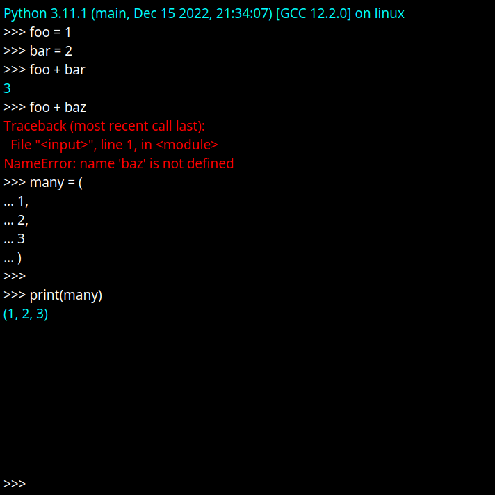

# PyQtCmd

We tend to think of command-line and GUI applications as mutually exclusive
groups, but sometimes it can be useful to embed a command-line interface
within a GUI. Blender is an example of a rich GUI application that
has a command-line component (the python console). This package provides
a rudimentary implementation of this concept in PyQt.

## Features

- History navigation
- Multi-line commands
- Customizable text colors for standard input, output, and error

## Notable missing features

- Support for control sequences (e.g. interrupt via ctrl-C)

## Gallery

[code](examples/python_interpreter.py)

## Attribution

Original idea and implementation by python forum user "deanhystad", available
[here](https://python-forum.io/thread-25117.html).